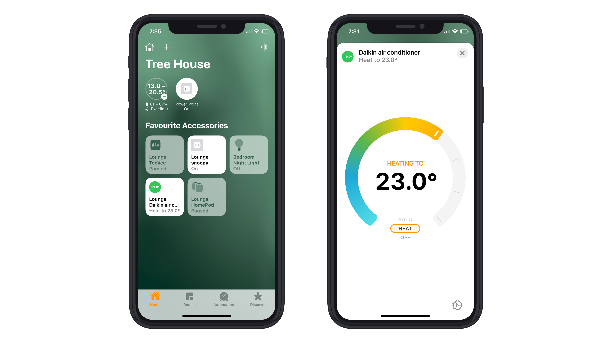

# HomeKit Daikin infrared accessory

An Apple HomeKit accessory for an infrared Daikin FTXS50KAVMA reverse cycle air conditioner remote control.



## Hardware

* Duinotech infrared receiver XC-4427 ([Jaycar](https://www.jaycar.com.au/arduino-compatible-infrared-receiver-module/p/XC4427))
* Duinotech infrared transmitter XC-4426 ([Jaycar](https://www.jaycar.com.au/arduino-compatible-infrared-transmitter-module/p/XC4426))

### Wiring

| Raspberry Pi pin | Infrared receiver pin |
| - | - |
| `9` Ground | `-` |
| `11` GPIO17 | `s` |
| `17` 3.3V | `middle` |

| Raspberry Pi pin | Infrared transmitter pin |
| - | - |
| `14` Ground | `-` |
| `12` GPIO18 | `s` |
| `01` 3.3V | `middle` |

## Software

* Install `LIRC`: `sudo apt install lirc`
* Copy the Daikin configuration codes file: `sudo cp codes/daikin.lircd.conf /etc/lirc/lircd.conf.d/`
* Restart LIRCd: `sudo systemctl restart lircd`
* Build the HomeKit executable: `go build homekit-daikin-infrared.go`
* Run the executable: `./homekit-daikin-infrared` or run the go file directly `go run homekit-daikin-infrared.go`
* In the Home app on your iOS device, add a new accessory with the code: `00102003`

### LIRC

To detect IR codes, run: `mode2`

If pressing your remote doesn't output anything, try: `mode2 --driver default`

You can also set this as a default by editing `/etc/lirc/lirc_options.conf`

```conf
# /etc/lirc/lirc_options.conf
driver = default
device = /dev/lirc0
```

If you install both the decoder and transmitter, the devices will appear:

* Transmitter: `/dev/lirc0`
* Decoder: `/dev/lirc1`

## Decoding Daikin IR codes

Find my collection of Daikin FTXS50KAVMA infrared codes in the [/codes/daikin](/codes/daikin) folder.

This was the process to create these text files:

* Run: `mode2 --driver default > power_on.txt`
* Press the power on button on your remote once
* `<control> + c` to quit

I modified [Ben's code](https://www.time0ut.org/blog/posts/aircooling_automation/) a little to convert those LIRC pulse widths into binary strings.

Find the decoder at [/codes/decode.py](/codes/decode.py):

* Run: `python3 decode.py power_on.txt`

Sample output: `00000BA1000100001011011111001000000000010100011000000000000000011101011BA1000100001011011111001000000000001000010000010011101110011111000BA10001000010110111110010000000000000000001001001001001100000000000000010100000000000000000110000000000110000000000000000010000011000000000000000000101010E`

Where:

* `A` = start of line
* `B` = end of line
* `E` = end of command

If you'd like to create a remote control codes file `*.lircd.conf` of your own, here are some instructions:

* Run mode2 with column display mode on: `mode2 --driver default -d /dev/lirc1 -m`
* Remove the end of line/start of line/end of command output (including the last pulse)
* Copy it inbetween `begin raw_codes` and `end raw_codes` with a header `name YOUR_COMMAND_NAME`

### Daikin FTXS50KAVMA IR codes

Here are the hex codes from the binary strings `decode.py` output:

```hex
# Power on

00 00
88 5B E4 00 A3 00 00 EB
88 5B E4 00 42 09 DC F8
11 0B 7C 80 00 12 49 80 00 A0 00 0C 00 C0 00 10 60 00 05
```

```hex
# Power off

00 00
88 5B E4 00 A3 00 00 EB
88 5B E4 00 42 A9 DC 24
11 0B 7C 80 00 02 49 80 00 A0 00 0C 00 C0 00 10 60 00 19
```

```hex
# Temperature up

00 00
88 5B E4 00 A3 00 00 EB
88 5B E4 00 42 E9 DC 64
11 0B 7C 80 00 02 45 80 00 A0 00 0C 00 C0 00 10 60 00 15
```

```hex
# Temperature down

00 00
88 5B E4 00 A3 00 00 EB
88 5B E4 00 42 19 DC E4
11 0B 7C 80 00 02 49 80 00 A0 00 0C 00 C0 00 10 60 00 19
```

The lengths seem to match these [reversed Daikin codes for a `ARC470A1` remote](https://github.com/blafois/Daikin-IR-Reverse#protocol-documentation).

## Sending IR codes

There's a sample LIRC config file: [/codes/daikin/daikin.lircd.conf](/codes/daikin/daikin.lircd.conf)

The `POWER_ON` command sets the heating/cooling mode `auto`, fan mode `auto`, temperature `23`.

There are individual temperature commands also with the mode `auto`, fan mode `auto`, e.g. `TEMPERATURE_AUTO_18`

This avoids having to deal with generating a dynamic `.conf` file for now.

* Copy it to the right location: `sudo cp codes/daikin/daikin.lircd.conf /etc/lirc/lircd.conf.d/`
* Restart LIRCd: `sudo systemctl restart lircd`
* Send your command: `irsend SEND_ONCE daikin POWER_ON`

Sending also works via the Go LIRC client: [/infrared-send/infrared-send.go](/infrared-send/infrared-send.go)

* Modify your command in: `infrared-send.go`
* Send it: `go run infrared-send.go`

## TODO

- [x] Decode IR codes for all of the functions we'd like to use
- [x] Send those IR codes using the Go LIRC client
- [x] Setup HAP Go library to send IR codes
- [x] Add a DHT22 temperature sensor to get the current temperature (see [add/1-dht22-temperature-sensor](https://github.com/sighmon/homekit-daikin-infrared/tree/add/1-dht22-temperature-sensor))
- [ ] Write Go class to programmatically create and send IR codes
- [ ] Setup GAP Go library to receive air conditioner commands

## Useful links

* Daikin remote: https://github.com/mharizanov/Daikin-AC-remote-control-over-the-Internet
* Arduino IRremote including Daikin: https://github.com/crankyoldgit/IRremoteESP8266
* Daikin IR protocol: https://github.com/blafois/Daikin-IR-Reverse
* Daikin Pi: https://github.com/dannyshaw/daikin-pi
* IR transmitter: https://core-electronics.com.au/digital-ir-transmitter-module-arduino-compatible.html
* HAP Go library: https://github.com/brutella/hap
* Go client for LIRC (Linux Infrared Remote Control): https://github.com/chbmuc/lirc
